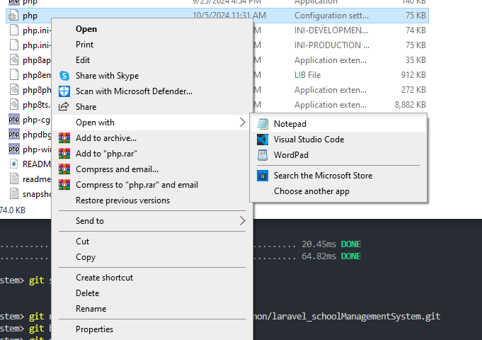
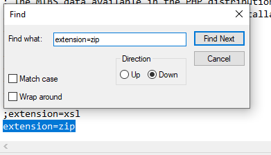

Step 1:
remove ";" in
extension=zip
extension=fileinfo
extension=pdo_mysql

Step 2:
composer install

Step 3:
copy the env file in gc.

Step 4:
php artisan migrate

Seed database
php artisan db:seed --class=InitialUserSeeder
